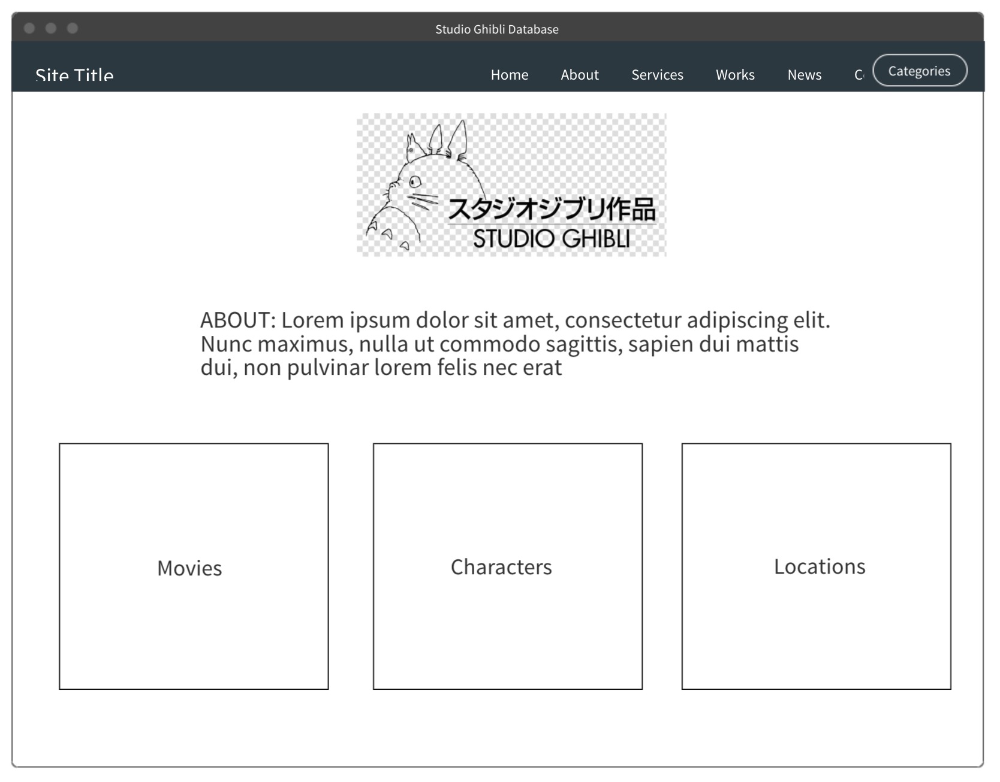
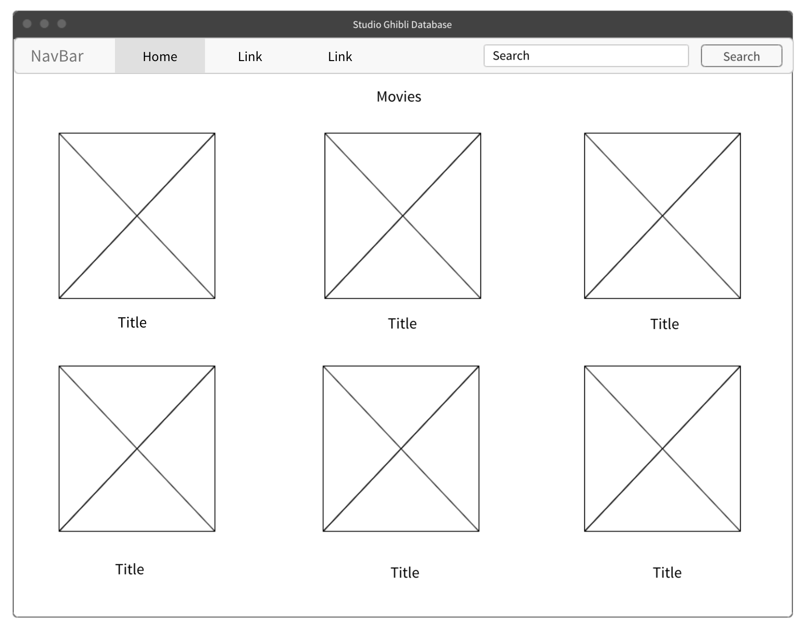
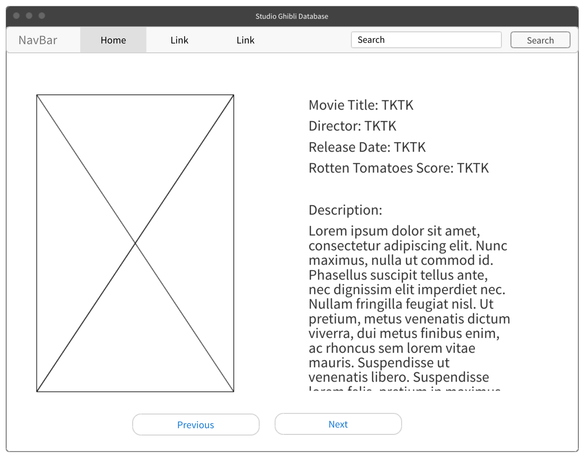

# Project 2 Proposal

## Project Description

My app is called Studio Ghibli Database. It's an app for people who want to learn more about the wondrous world of Studio Ghibli films. Users can see a list of all the Studio Ghibli films and click on them to learn more about them. In the future, I'd like to add a feature where you can also watch the trailer of the films or show where a Studio Ghibli festival is happening in the user's area. I would also like to add a recommendation function.

## Wireframes

### Home



### Movies List



### Movie Detail



### MVP User Stories

_**MVP User Stories**_

- _As a user, I want to see a listing of all the movies Studio Ghibli has made._
- _As a user, I want to click on a specific movie and read a description of the movie and further details like, director, Rotten Tomato score, and release date._
- _As a user, I want to easily navigate the movies on my mobile device so I can view movie details._

_**Post MVP Stretch Goal**_

- _As a user, I would like to be able to search for movies by name so I can easily find a movie and view its details._
- _As a user, I would like to view the details of characters and locations in each movie, if that information is available._
- _As a user, I would like to be recommended a movie to watch._
- _As a user, I would like to view the trailer of the movie._

## API

[Studio Ghibli API Documentation](https://ghibliapi.herokuapp.com/#)

### API Sample Response

```json
{
	"film": {
		"id": "2baf70d1-42bb-4437-b551-e5fed5a87abe",
		"title": "Castle in the Sky",
		"description": "The orphan Sheeta inherited a mysterious crystal that links her to the mythical sky-kingdom of Laputa. With the help of resourceful Pazu and a rollicking band of sky pirates, she makes her way to the ruins of the once-great civilization. Sheeta and Pazu must outwit the evil Muska, who plans to use Laputa's science to make himself ruler of the world.",
		"director": "Hayao Miyazaki",
		"producer": "Isao Takahata",
		"release_date": "1986",
		"rt_score": "95",
		"people": ["https://ghibliapi.herokuapp.com/people/"],
		"species": [
			"https://ghibliapi.herokuapp.com/species/af3910a6-429f-4c74-9ad5-dfe1c4aa04f2"
		],
		"locations": ["https://ghibliapi.herokuapp.com/locations/"],
		"vehicles": ["https://ghibliapi.herokuapp.com/vehicles/"],
		"url": "https://ghibliapi.herokuapp.com/films/2baf70d1-42bb-4437-b551-e5fed5a87abe"
	}
}
```

## Component Hierarchy


### Component Details

| Component  | Description                                                      | State/Props |
| ---------- | ---------------------------------------------------------------- | :---------: |
| App        | This will make the initial data request and include React Router |    State    |
| Header     | This will render the header include the nav                      |    Props    |
| Homepage   | This will render the homepage                                    |    Props    |
| MoviesList | This will render all of the movies                               |    Props    |
| Movie      | This will render an individual movie                             |    Props    |
